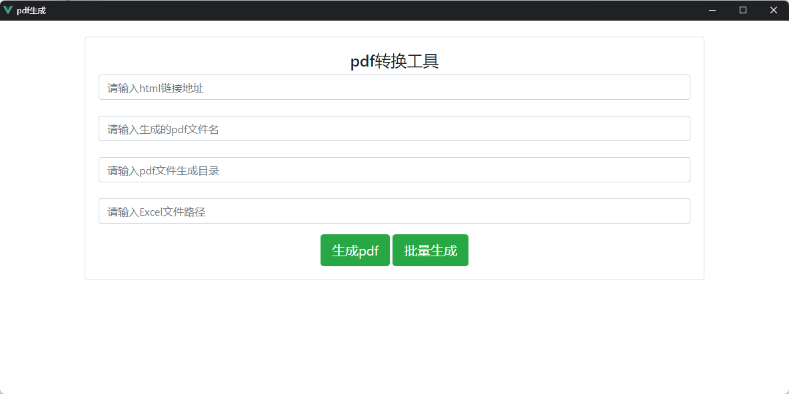

# topdf
基于wkhtmltopdf的html链接转pdf文件工具，可输入url转换或导入Excel文件批量转换

### 使用方式

1. 启动main.py脚本即可打开页面
2. 输入需要转换的html连接地址、想要生成pdf的文件名、文件生成目录后点击【生成pdf】按钮即可
3. 批量生成功能需按项目中的temp.xlsx文件准备Excel表格文件，在页面输入pdf文件生成目录和Excel文件路径，点击批量生成按钮即可
4. 无python运行环境可下载dist/main.zip文件，解压后直接运行main.exe即可

### 界面图

